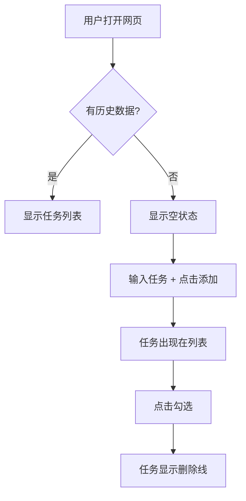

# 3.3 PRD 标准模板与避坑指南

这一节讲解 PRD 模板的结构和每个字段的作用。完整模板可以在[资源下载](/resources)获取。

## 模板总览

PRD 模板分为五大部分，对应"一五九稿"的迭代原则：

| 部分 | 对应稿次 | 核心内容 |
|------|---------|---------|
| **第0部分：文档信息** | 始终记录 | 版本、阶段、更新记录 |
| **第一部分：需求背景与目标** | 1稿 | 为什么要做、为谁做、解决什么问题 |
| **第二部分：方案概述** | 5稿 | 业务流程、功能流程、信息架构 |
| **第三部分：细节方案** | 9稿 | 交互说明、边缘Case、非功能需求 |
| **第四部分：上线计划** | 9稿 | 排期、灰度发布 |

**一五九稿原则**：1稿想清楚"为什么"，5稿想清楚"是什么"，9稿想清楚"怎么做"。

---

## 第0部分：文档信息

这部分记录文档的版本状态和迭代历史。

### 文档状态

- **当前版本**：如 "5.1稿" — 5是稿次，1是该稿次的微版本
- **当前阶段**：需求评审 / UI设计中 / 开发中 / 已上线
- **核心干系人**：产品、研发、设计、测试等负责人

**对 AI 的影响**：版本信息让 AI 知道这是"初稿"还是"定稿"。定稿应该更详细，初稿可以留 TBD。

---

### 更新记录

记录从 1.1 到 9.1 的迭代过程：

| 版本号 | 版本状态 | 更新内容 |
|-------|---------|---------|
| 1.1 | 内部评审稿 | 初步阐述需求背景、目标和核心价值 |
| 5.1 | 项目评审稿 | 补充核心业务流程、功能流程图 |
| 9.1 | 开发前定稿 | 合入UI设计稿，补充边缘Case、埋点方案 |

**为什么重要**：让 AI 知道哪些是稳定的、哪些可能还在变化。

---

## 第一部分：需求背景与目标

这是 PRD 的灵魂，对应 1稿的核心内容。

### 1.1 项目概述

用一两句话概括产品是什么。

| 好的概述 | 差的概述 |
|---------|---------|
| 一个给自己用的极简待办清单网页 | 一个待办清单应用 |

**为什么重要**：AI 需要快速理解你要做什么。模糊的概述会导致 AI 做出复杂版本。

---

### 1.2 核心问题

回答三个问题：

1. **目标用户画像**：谁用？（具体特征，不是"所有人"）
2. **用户场景**：什么时间、什么地点、什么情境下用？
3. **核心痛点**：现有方案有什么问题？

| 漏写 | 后果 |
|------|------|
| 没说用户是谁 | 可能做成"所有人都能用"的复杂版 |
| 没说场景 | 可能用不适合的技术（手机端做成桌面版） |
| 没说痛点 | 可能做了"完美"功能，但解决的是伪需求 |

---

### 1.3 用户故事

从用户视角描述需求：

> 作为一名 **[角色]**，我想要 **[完成某项任务]**，以便于 **[实现某个价值]**

这比"我要做一个功能"更贴近用户。

---

### 1.5 需求范围

明确"做哪些"和"不做哪些"。

**In-Scope（范围内）**：明确要做的功能点

**Out-of-Scope（范围外）**：明确**不做**哪些

> 💡 **关键**：Out-of-Scope 在 3.2 跟 AI 讨论时就应该确认。这里只是把讨论结果记录下来。

| 不写 Out-of-Scope | 写了 Out-of-Scope |
|-------------------|-------------------|
| AI 可能自动加上"常见功能" | AI 明确知道边界 |
| 范围不断蔓延 | 保持产品聚焦 |

---

### 1.6 需求列表

将宏观需求拆解为具体需求点，并标注优先级：

| 需求ID | 模块 | 描述 | 优先级 | 状态 |
|--------|------|------|--------|------|
| R001 | 添加任务 | 用户可以添加待办任务 | 高 | 规划中 |
| R002 | 删除任务 | 用户可以删除任务 | 高 | 规划中 |
| R003 | 历史记录 | 查看历史任务 | 低 | V2.0考虑 |

**为什么重要**：让 AI 知道哪些是核心（P0）、哪些可以延后。

---

## 第二部分：方案概述

对应 5稿，用可视化方式展示产品全貌。

### 2.1 核心业务流程图

用 Mermaid 描述用户完成核心任务的完整流程。



| 只有文字 | 有流程图 |
|---------|---------|
| AI 可能理解错步骤顺序 | AI 一眼看懂流程 |
| 可能有歧义 | 可视化无歧义 |

**为什么重要**：流程图让 AI 准确理解业务逻辑，减少误解。

> 💡 跟 AI 说"用 Mermaid 画个流程图"就行，不需要学语法。

---

### 2.2 信息架构

列出产品的页面结构和层级关系：

- **首页**
  - 导航栏
  - 任务列表
- **设置页**
  - 主题设置
  - 数据管理

**为什么重要**：让 AI 理解产品有哪些页面、它们如何组织。

---

## 第三部分：细节方案

对应 9稿，是最详尽的部分，是 AI 写代码的直接依据。

### 3.1 页面原型与交互说明

描述每个页面的完整交互流程：

1. **初始状态**：页面刚加载时是什么样
2. **触发操作**：用户做什么
3. **成功状态**：成功后显示什么
4. **失败状态**：失败后显示什么
5. **空状态**：没有数据时显示什么

| 只写"用户可以添加任务" | 写完整交互逻辑 |
|----------------------|-------------|
| AI 不知道加在哪、怎么显示 | AI 知道输入框位置、按钮样式、列表如何更新 |

---

### 3.2 边缘Case处理

这是新手最容易漏掉的部分。

| 边缘Case | 不写会怎样 |
|----------|-----------|
| 用户快速点击按钮两次 | 可能重复提交 |
| 网络出错时 | 用户不知道发生了什么 |
| 数据为空时 | 可能显示空白或报错 |
| 用户中途退出 | 可能数据丢失 |

**一定要写**：

- 用户快速点击"添加"按钮 → 做防抖处理，0.5秒内只响应一次
- 网络请求失败 → 显示 Toast 提示："网络错误，请重试"
- 任务列表为空 → 显示空状态插图："暂无任务，添加一个吧"

---

### 3.3 非功能性需求

| 需求类型 | 为什么重要 |
|---------|-----------|
| 性能 | 不写 → AI 可能做很重，加载很慢 |
| 兼容性 | 不写 → 可能只支持 Chrome，Safari 用户无法使用 |
| 数据埋点 | 不写 → 上线后无法追踪使用情况 |

---

## 第四部分：上线计划

定义需求的生命周期。

### 上线排期

| 阶段 | 日期 |
|------|------|
| 需求评审 | YYYY-MM-DD |
| UI/UX设计 | YYYY-MM-DD ~ YYYY-MM-DD |
| 研发阶段 | YYYY-MM-DD ~ YYYY-MM-DD |
| 预计上线 | YYYY-MM-DD |

**为什么重要**：让 AI 知道项目时间线，合理规划开发顺序。

---

## 让 AI 填充模板

在 3.2 确认 AI 理解正确后，让它基于模板生成 PRD：

> "请基于我们的讨论，用 PRD 模板生成文档。如果某个字段我们没讨论过，请标注 TBD（待确定）。"

**你的职责**：

1. **检查 AI 生成的 PRD** — 确认每个字段基于讨论，不是 AI 猜的
2. **补充 TBD 字段** — 对于"待确定"的部分，补充细节或明确"不需要"
3. **纠正误解** — 发现与讨论不一致的地方，立即纠正

---

## 好 PRD vs 坏 PRD

### 坏 PRD

```markdown
# 待办清单

做一个待办清单功能，用户可以添加任务、勾选完成。
```

**问题**：
- 没说用户是谁 → 可能做成团队版
- 没说核心功能 → 可能加一堆不需要的功能
- 没说 Out-of-Scope → 可能加登录、云同步
- 没说边缘Case → 快速点击会重复提交
- 没有流程图 → AI 可能理解错业务逻辑

---

### 好 PRD

```markdown
# 极简待办清单

## 1.1 项目概述
一个给自己用的极简待办清单网页，只有添加和勾选功能。

## 1.2 核心问题
- **目标用户**：我自己（职场人士，每天处理 5-10 个任务）
- **用户场景**：早上打开电脑，快速看今天要做什么
- **核心痛点**：便签纸容易丢，手机备忘录打开麻烦

## 1.5 需求范围
**In-Scope**: 添加任务、查看列表、勾选完成、删除任务
**Out-of-Scope**: 登录注册、云同步、分类标签

## 2.1 核心业务流程
[Mermaid 流程图]

## 3.1 边缘Case处理
- 快速点击"添加" → 0.5秒防抖
- 列表为空 → 显示"暂无任务"
- 刷新页面 → 数据不丢失（localStorage）
```

---

## 本节核心要点

- ✅ PRD 模板有 5 大部分，对应"一五九稿"迭代原则
- ✅ **核心业务流程图** 让 AI 准确理解业务逻辑
- ✅ **边缘Case处理** 是新手最容易漏掉的
- ✅ **Out-of-Scope** 防止 AI 自由发挥（在 3.2 确认，这里记录）
- ✅ **你负责检查** — AI 生成的 PRD 要逐字段检查
- ✅ 让 AI 把没讨论过的标注 TBD，而不是盲目猜测

PRD 写好后，接下来理解 AI 如何理解并执行它（3.4）。

---

## 资源下载

[完整 PRD 标准模板.md](/resources/prd-template) — 可下载直接使用
