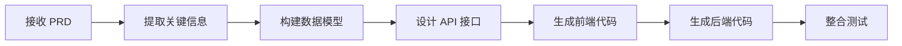
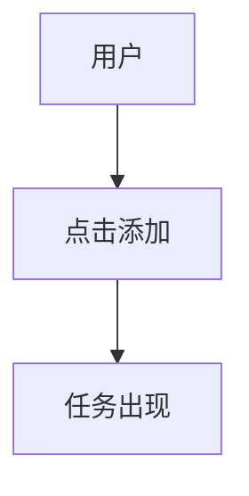

# 3.4 理解 AI 如何执行 PRD

这一节讲 AI 如何理解并执行你的 PRD。

为什么需要理解？因为**知道 AI 如何"读"PRD，你就能写出它更容易理解的 PRD**，减少误解和返工。

## AI 是如何"读"PRD 的

你的 PRD 不是给人看的，是给 AI 看的。AI"读"PRD 的方式和人不同：

| 人的阅读方式 | AI 的阅读方式 |
|-------------|--------------|
| 从头到尾读一遍 | 把 PRD 分解成"信息块" |
| 跳过重复内容 | 每个字段都处理 |
| 会"脑补"模糊的地方 | 严格按字面意思理解 |
| 会主动问不清楚的地方 | 不问就按默认理解处理 |

**核心差异**：AI 不会"脑补"，你写的每个字都会影响它生成的代码。

## AI 的执行流程

当你把 PRD 给 AI 后，AI 内部经历了这些步骤：



### 步骤1：提取关键信息

AI 从 PRD 中提取：
- 用户是谁 → 影响 UI 设计风格
- 核心功能 → 决定代码结构
- 业务流程 → 决定逻辑顺序
- Out-of-Scope → 防止"自由发挥"

**如果你写得太模糊**，AI 会：
- 要么按"常见做法"猜测（可能猜错）
- 要么问你要更多细节（增加对话轮次）

### 步骤2：构建数据模型

AI 根据 PRD 中的"数据"相关描述，设计数据结构：

| PRD 中的描述 | AI 理解的数据结构 |
|-------------|------------------|
| "任务有标题、完成状态" | `{ title: string, completed: boolean }` |
| "用户可以添加多个任务" | `tasks: Array<Task>` |
| "数据需要保存" | 需要 localStorage 或数据库 |

**如果你没说需要保存什么数据**：
- AI 可能漏掉关键字段
- 后期要重构数据结构

### 步骤3：设计业务逻辑

AI 根据 PRD 中的流程图和交互描述，编写代码逻辑：

| 交互描述 | AI 生成的代码逻辑 |
|---------|------------------|
| "点击添加按钮，任务出现在列表" | `handleAddTask()` 函数 |
| "点击勾选，任务显示删除线" | `toggleTask()` + CSS 样式 |
| "快速点击防抖" | `debounce()` 或 `disabled` 状态 |

**如果你没写边缘Case**：
- AI 可能不做防抖
- 可能不做错误处理

## 为什么 PRD 质量决定代码质量

### 例子1：没写 Out-of-Scope

❌ **PRD**：
```markdown
# 待办清单
用户可以添加任务、勾选完成。
```

**AI 生成的代码**：
- 可能有登录功能
- 可能有云同步
- 可能有分类标签

→ 结果：代码比你想象的复杂得多

---

✅ **PRD**：
```markdown
# 待办清单

## 核心功能
- 添加任务
- 勾选完成

## Out-of-Scope
- 不要登录注册
- 不要云同步
- 不要分类标签
```

**AI 生成的代码**：
- 只有你要求的功能
- 代码简洁

---

### 例子2：没写边缘Case

❌ **PRD**：
```markdown
用户可以点击添加按钮添加任务。
```

**AI 生成的代码**：
```javascript
function addTask() {
  tasks.push(newTask);
}
```

→ 问题：快速点击会重复添加

---

✅ **PRD**：
```markdown
用户点击添加按钮添加任务。

边缘Case：快速点击防抖，0.5秒内只响应一次。
```

**AI 生成的代码**：
```javascript
function addTask() {
  if (isAdding) return; // 防抖
  isAdding = true;
  tasks.push(newTask);
  setTimeout(() => isAdding = false, 500);
}
```

## AI 理解 PRD 的"盲区"

AI 有一些理解盲区，写 PRD 时要注意：

### 盲区1：默认值

| 你写的 | AI 理解的默认值 |
|--------|---------------|
| "显示任务列表" | 列表最多显示多少条？AI 可能猜 10、50、100 |
| "按钮点击后..." | 按钮要禁用吗？AI 可能不处理 |
| "数据保存" | 保存多久？AI 可能猜"永久" |

**解决方案**：明确写出你期望的默认值

---

### 盲区2：状态变化

| 你写的 | AI 可能误解 |
|--------|-----------|
| "任务可以勾选完成" | 勾选后是删除线？移到底部？还是消失？ |
| "加载中..." | 加载中按钮要禁用吗？要显示转圈吗？ |

**解决方案**：用状态描述："初始状态 → 触发 → 加载中 → 成功/失败"

---

### 盲区3：优先级

| 你写的 | AI 可能误解 |
|--------|-----------|
| 列了一堆功能 | AI 可能按列出的顺序全部实现 |
| 没说哪些重要 | AI 可能把次要功能做得太复杂 |

**解决方案**：用 P0/P1/P2 标注优先级

## 让 AI 更好地理解你的 PRD

### 技巧1：用结构化格式

AI 对 Markdown 结构有很好的理解：

```markdown
## 核心功能
- 功能1
- 功能2

## Out-of-Scope
- 不要xxx
- 不要yyy
```

比纯文字段落更清晰。

---

### 技巧2：用例子

不要说"界面要好看"，要说"白色背景，蓝色按钮，无边框圆角"。

不要说"要流畅"，要说"点击后 0.5 秒内响应"。

---

### 技巧3：用 Mermaid 流程图

AI 能"看懂" Mermaid 流程图：



这比文字描述更准确。

---

### 技巧4：让 AI 总结确认

每写完一个部分，让 AI 总结：

> "请你总结一下，我们刚才确定的核心功能有哪些？"

检查 AI 的总结，确保理解一致。

---

## 方案先行，实现为后

一个有效的实践：**让 AI 先输出技术方案，再写代码**。

> "请先给出这个功能的技术实现方案，包括数据结构、接口定义、主要步骤。我确认后你再写代码。"

为什么这样做更好：

| 直接让 AI 写代码 | 先让 AI 输出方案 |
|-----------------|-----------------|
| AI"边想边写"，容易逻辑断层 | AI 先捋清思路，有明确锚点 |
| 有误解返工量大 | 方案阶段就能发现问题 |
| 代码质量不可控 | 方案确认后再写，更稳定 |

这是"思维链"的应用——把复杂任务拆成"先想清楚再动手"两步。

## 本节核心要点

- ✅ AI 严格按 PRD 字面意思理解，不会"脑补"
- ✅ PRD 每个字段都会影响 AI 生成的代码
- ✅ 没写 Out-of-Scope → AI 可能"自由发挥"
- ✅ 没写边缘Case → AI 可能不做错误处理
- ✅ AI 有理解盲区：默认值、状态变化、优先级
- ✅ 用结构化格式、具体例子、Mermaid 流程图让 AI 更准确理解
- ✅ **方案先行** — 让 AI 先输出技术方案，确认后再写代码

第三章学完了。接下来第四章：开发常识与技术栈。
